# Portfolio: Bram van Hout @ Fontys IT - Eindhoven
This is the portfolio written by semester 3 Software student of Fontys IT ***Bram van Hout***.

## Reader's Guide for Semester 3 Portfolio
Written by: ***Bram van Hout***\
For course(s): ***S-DB-IPS3 & S-DB-GPS3***\
Class: ***DB-03***\
Coaches: ***Marc van Grootel, Hans van Heumen***\
Date: ***30-11-2022***

| Version | Date | Current |
|---|---|---|
| 1.0 | 03/11/2022 | False |
| 1.1 | 30/11/2022 | False |
| 1.2 | 06/01/2023 | True |

## Table of contents
* [Introduction](#introduction)
* [Learning outcomes](#learning-outcomes)
* [Research](#research)
* [Courses](#courses)
* [Software desicions](#software-desicions)
* [FitOne ( Individual Project )](#fitone--individual-project-)
* [WoC ( Group Project )](#woc--group-project-)

## Introduction
Portfolio about me and the projects i've worked on so far.
In this document you will find all the learning outcomes and how i managed to achieve them and in what way.
Also all the decisions that i've made will be explained clearly.

## Learning outcomes
The learning outcomes for this semester are based on a ***A(ssociate)D(egree)*** level

| #  | Name | Description | Clarification |
|---|---|---|---|
| 1 | Web application | You design and build user-friendly, full-stack web applications | User friendly: You apply basic User experience testing and development techniques. Full-stack: You design and build a full stack application using commonly accepted front end (Javascript-based framework) and back end techniques (e.g. Object Relational Mapping) choosing and implementing relevant communication protocols and addressing asynchronous communication issues.  |
| 2 | Software quality | You use software tooling and methodology that continuously monitors and improve the software quality during software development | Tooling and methodology: Carry out, monitor and report on unit integration, regression and system tests, with attention for security and performance aspects, as well as applying static code analysis and code reviews. |
| 3 | Agile method | You can implement the software process for your project according to a given agile software development method | Agile method: You are aware of most popular agile methods and their underlying agile principles. You are able to implement the process of your software project according to a chosen methodology. |
| 4 | CI/CD | You implement a (semi)automated software release process that matches the needs of the project context | Implement: You implement a continuous integration and delivery solution (using e.g. Gitlab CI and Docker). |
| 5 | Cultural differences and ethics | You recognize and take into account cultural differences when working with multi-site teams, and are aware of ethical aspects in software development | Recognize:  Recognition is based on theoretically substantiated awareness of cultural differences and ethical aspects in software engineering.Take into account: Adapt your communication, working, and behavior styles to work with other developers from different cultures; Address one of the standard Programming Ethical Guidelines (e.g., ACM Code of Ethics and Professional Conduct) in your work. |
| 6 | Requirements and design | You translate (non-functional) requirements to extend existing (architectural) designs and can validate them using multiple types of test techniques | Multiple types of test techniques: You apply user acceptance testing and stakeholder feedback to validate the quality of the requirements. You evaluate the quality of the design (e.g., by testing or prototyping) taking into account the formulated quality properties like security and performance. |
| 7 | Business processes | You can explain simple business processes and relate them to the development of your software project | Simple: predominantly sequential processes with one or two alternative paths. Relate: understanding the relationships between the process and software. |
| 8 | Professional | You act in a professional manner during software development and learning | Professional manner: You develop software as a team effort according to a prescribed software methodology and following team agreements. You are able to track your work progress and communicate your progress with the team. You  independently recognize and decide where your knowledge falls short to solve a software problem and  communicate which new knowledge and skills you need to learn. |

## Research

### Agile methods
For this semester i chose for both the projects to use the agile method called SCRUM. I did some research on why to use SCRUM for this type of project and what other methods there are to choose from and what theire benefits are. This product helps prove my proficiency at learning outcome 3: ***Agile method***.\
[Click here to see the Agile Methods file](Research/AgileMethods.md)

### Business processes
Some research was done on business processes for helping improve my proficiency on learning outcome 7: ***Business processes***.\
[Click here to see the Business process file](Research/BusinessProcesses.md)

### Distributed Software Systems
One thing that i started doing research on was ***Distrubuted Software Systems***\
[Click here to see the DSS research](Research/DSS.md)

### Software and design
Because there are so many different front- and backend frameworks, some research seemed necessary. By doing this kind of research, i help improve my 
proficieny for learning outcome 6: ***Requirements and design***. \
[Click here to see the Software and design file](Research/UXdesign.md)

### Ethics
I did some essential research on the Ethics topic. Ethics is where you recognize and take into account cultural differences when working with multi-size teams, and are aware of ethical aspects in software development. I have made an analysis and did some additional research to increase proficiency at learning outcome 5: ***Cultural differences and ethics***.\
[Click here to see the Ethics file](Research/Ethics.md)

### Testing 
I did some useful research on what kind of tests i should be performing within the FitOne project. \
[Click here to see the testing research file](Research/Testing.md)

### Effective Learning
I also did some research on something that i thought was neccesary especially for me, since i've always had some trouble planning my work.\
[Click here to see the Effective Learning file](Research/EffectiveLearning.md)

## Feedpulse
Ofcourse communciation with the stakeholder is very important. By communicating with the stakeholders and showing what i've been working on during the week, i help improve my proficiency for learning outcome 8: ***Professional***. To see all the feedpulses that where covered during this semester, click on the link below. \
[Click here to see the feedpulse file](Feedpulse/FP_Volledig.pdf)

## Courses
### React JS Crash Course
Since i was quit new with React JS, i decided to look up on the internet for a simple tutorial to inform me about the most basic functionalities and methods of React.
After searching for a while, i came across a youtube video that explained the entire basic React environment and it's functionalities.\
Source: 
https://www.youtube.com/watch?v=w7ejDZ8SWv8&t=839s

### LinkedInLearning
#### React JS Essentials training
After watching the React JS Crash Course, i discovered that trough the portal of Fontys, i could get a FREE account for LinkedInLearning. Which was great news, because 
LinkedIn is a very powerful platform which shows your skills, studies and working experience on the web. Trough completing the LinkedInLearning React JS Essential training, a certificate was added to my profile! Which is a very good thing, so my connections can see that i have the necessary experience with React JS.\

Source:
https://www.linkedin.com/learning/react-js-essential-training-14836121/building-modern-user-interfaces-with-react?autoplay=true&u=2095956

#### MERN Essential training
After completing the JS React Essential training as stated above, i went and searched for some more detailed back- to frontend essentials. I came across the MERN training on LinkedInLearning, which showed me how to create a fullstack webapp including a backend with controllers, routes, functions and a stable connection to a MongoDB scheme. it also showed how to properly connect the backend to the frontend and create a working CRUD system. MERN stands for MongoDB, Express, React and Node. 

Source:
https://www.linkedin.com/learning/mern-essential-training/learn-all-about-mern?autoplay=true&u=2095956

## Software desicions

This document has been written because i wanted to find out how the communication works between the frontend- and the backend software in the FitOne project. Let’s start with working out why we chose the front- and backend that we chose. In this case, Javascript React and ( dot ) NET.

### Frontend – Javascript React
What is the reason that i chose for Javascript React? At first, one of my classmates was excited about React and told me he worked with the software in previous projects. He explained that it worked well with other software and that is was easy to understand and use in a project. This excited me a bit, because i don’t want to spend lots of time understanding a new language. I really want to make a start in the design of the project and start creating those pages, without functionality for now. 

Next to asking people around me why to choose for React, i also went ahead and did some research why it’s such a fine software language to learn. 

Recording to this site: https://www.freecodecamp.org/news/why-use-react-for-web-development/

React is a very flexible type of software, which makes it easy to use on a vast variety of platforms.
React was created with a single focus, which is creating components for webapplications. Which could be a button, text, label or grid. It also is very usefull for altering a smaller part of your code. That is where it is designed for. Maybe there is a component you’d like to change with React, which you can easily do.

### Frontend – Bootstrap 5
Bootstrap ( 5 ) is a frontend toolkit that is great to use in all kinds of webapplications. It’s used for fast component integration and responsive layouts. The Grid system is also a very usefull system for creating a nice layout. You can work with containers, rows and columns, to give the website a complete and functional layout. My experience with Bootstrap has been great, and I have made a few websites with the toolkit. 

### Backend – Node.js
For creating the backend of this project, i chose to use Node.js as my backend structure. This because it is easy to implement into VS-Code and practical to use with React JS. Node.js also works pretty wel with the database server MongoDB and Docker. In the previous semester we worked with ASP.Net MVC to create an entire fullstack webapplication. This time Node.js, React JS, MongoDB and Docker to run all the services on creates the entire stack.

### Database – MongoDB
The reason i chose for MongoDB is because it is very easy to use and implement into your project. At the beginning of this semester we were told not to write any queries by hand this semester. So, it was necessary to find a database client that could work without hand made sql queries. MongoDB seems to do the trick. It is also very capable with API's, since they come as JSON files, which MongoDB handles easily. 

## FitOne ( Individual Project )
![alt text][logo]

[logo]: https://github.com/Brummer98/Portfolio_BramvHout/blob/619cb818cae5127c40a393ec811ce160fcbb2a86/img/FitOneLogo.png "FitOne logo"

FitOne is my individual project and is a web based fitness and food tracking application where users are able to have insights into their daily food consumption and are also able to see how many caloriës they can eat every day. You can add food easily and see directly how many carbs, protein and fat it contains. To see the repository for FitOne, click [here](https://github.com/Brummer98/FitOne)

### Sprints
I divided the project over an estimated 5 sprints to figure everything out and have a fullstack webapplication by the end of it. That meant planning was necessary to achieve this goal. Since i knew nothing about the framework ***React JS*** i started doing some research in the first sprint. I also did some research on the backend of the webpage, which i made in ***Node.js***. In the second sprint, things came alive. I figured out how to use React JS to create a beautiful frontend webpage for my project. We are now reaching the end of the second sprint and i'll be focussing on getting the backed working in the next sprints. 

### Frontend 

#### Home
The home page shows several widgets that contain data based on the user's food diary. It shows how many calories they can still eat / have eaten. It shows the amount of Fat, Protein and Carbs that they have been eating. It also shows the user's food diary where they can add or delete food.

#### Personal 
The personal page shows all the details about the user, such as:
* Name
* Age
* Weight
* Calories

#### Login - Logout
This pages only shows two buttons, one for logging in and one for logging out. The login button is a link to the authenticator integrated into FitOne.

#### Auth0 - Authentication
For the authentication i integrated a piece of software called ***Auth0***. This is used for users to authenticate them to gain access to FitOne's features.
Because i'm making use of an authenticator such as ***Auth0***, i help improve my proficiency for ***Learning outcome 2: Software quality***.

#### Create user
This page contains a form where a user is able to be created. Form includes:
* Username
* Password
* Age
* Weight
* Calories

### Backend

#### MongoDB
In the first version of this file you could read that i've had chosen Microsoft SQL Server as my database provider. Later on i heard that this semester was not meant for writing SQL statements by hand. On that note, i searched for something other. I came across MongoDB, which a lot of my classmates used aswell. It workes perfectly fine with this project, and was really easy to install with my Node.js backend. Also, MongoDB works wel with JSON files, which i'm getting in the API.

###### version 1.2

In the latest version i decided that my mongo database should be hosted on a cloud instead of locally. This because my CI/CD pipeline functions beter with an online cloud based database then a local one. So by doing a small bit of research, i decided to go with ***MongoDB - Atlas*** to host my database on. It was very easy to configure and works like a charm. I did not have to do any big changes to my code, i only had to replace the connnectionstring to the new one.

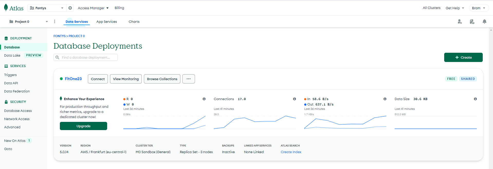

#### CRUD
CRUD stands for ***Create, Read, Update and Delete***. A CRUD system could be used for managing users etc. In the FitOne application, it is used to create users and add products loaded in from an API into a MongoDB scheme. The scheme exists out of a table where all elements are defined. So, a user that registers on the FitOne page needs to fill in the following fields to create an account:
* Username
* Password
* Age
* Weight
* Calories
* ( Length to be added )

Because i am making use of an own build CRUD system, i help improve my proficiency for ***Learning outcome 1: Web application***

### SCRUM
I've made use of the SCRUM framework for this project and chose GitHub - projects as the tool to help me manage this process.
[Click here to see the GitHub SCRUM enviroment](https://github.com/users/Brummer98/projects/1/views/1)

### Web application
By using a Javascript framework like React JS, i help improve my proficiency with ***learning outcome 1: Web application***.

### Software design
For the FitOne application i have made several user stories, requirements and a software architecture diagram. Documentation like such can be found on the ***FitOne software design*** directory. This section is part of proving my proficiency at learning outcome 6: ***Requirements and Design***.
[Click here to see the file](FitOne/Software_design.md)

## CI/CD

As i've been working with ***GitHub*** - Desktop version, i have been working with different branches. In the CI/CD image above, you can see ***release***
and ***deploy***. By using GitHub desktop and managing multiple branches, i make use of CI/CD in that way. Working in one branch to test multiple pieces of code, whilst the other branch contains the final product. 

As seen in the above image, i've been pushing several new changes into my branch, proving a part of my proficiency for learning outcome 4: ***CI/CD***.

### CI & CD

As part of CI testing, i started with creating a ***workflow*** file in my repository of the FitOne project. A workflow file contains a piece of code which runs a type of build. I started with a simple one that runs all of my test files within the backend directory of my project. because i implemented this workflow, it will now cooperate perfeclty fine with ***GitHub Desktop*** everytime a push is made to the main branch. So, every single push will then receive a check because of the workflow file. 

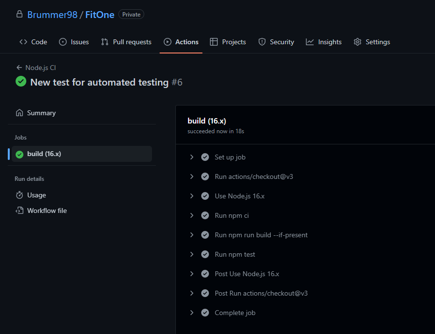

#### CI testing backend CRUD / integration tests
For testing my backend it was necessary to test all of the functionalities in the controller, so basically the entire CRUD system. Which means: Adding a new user, updating one, deleting one, searching a specific one and getting all users. All of these functionalities respond with statuscodes. The tests are shown in the below images.

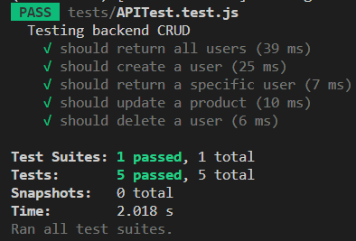

###### Getting all users

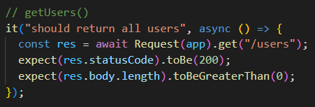

###### Adding a new user

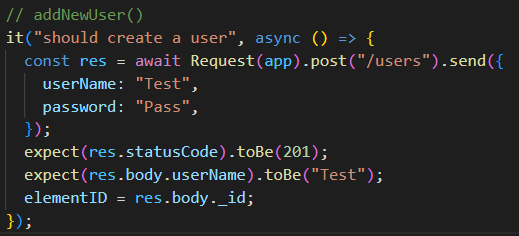

###### Get specific user by id

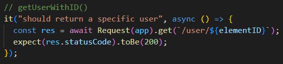

###### Update a user by id

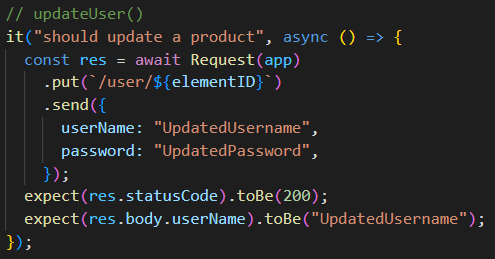

###### Delete a specific user by id

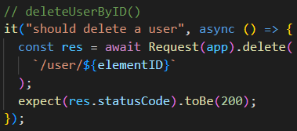

#### Performance test with Smartmeter

For my performance test, i implemented a piece of software called Smartmeter, where i could record my page and test all the functionalities to see how long it would take for an event to take place.

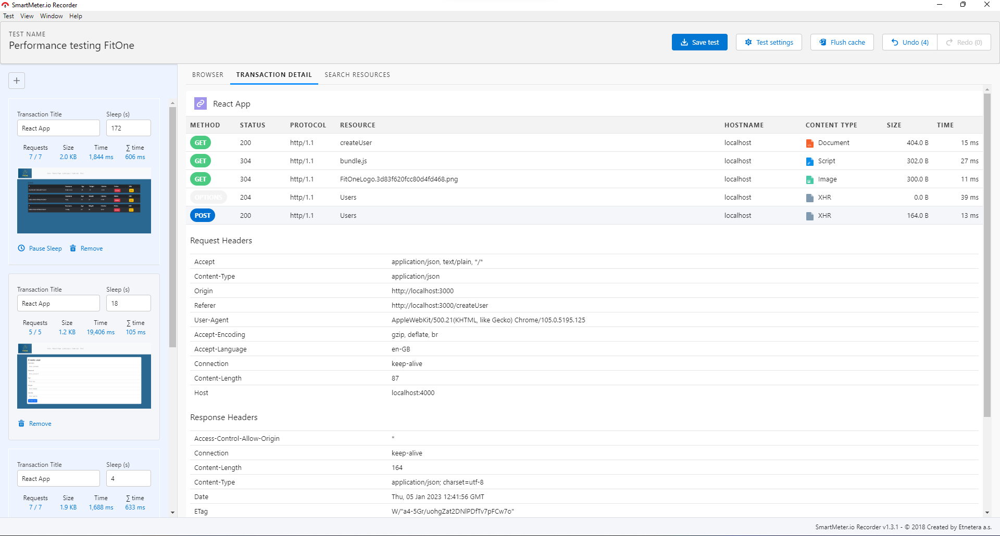

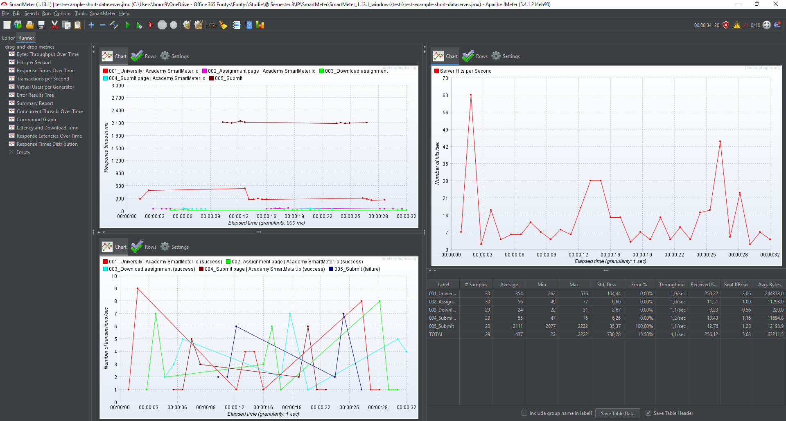

#### Unit test
Unit testing should be done by testing a single function. I did manage to perform several tests, but those were integration, security and regression tests. I've spoken to Hans about unit testing and he told me that is was fine without because i already made unit tests in the previous semester. If i were to test my code with unit tests, i would use the Render method to be tested and see of it renders a certain page. I also made a mock function to test something simple.

###### Sum test
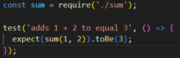

###### Render test
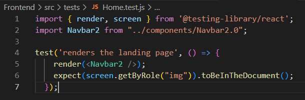

#### Security test
I've already did a couple of things to ensure my securty is all good. I implemented Auth0 for authorization. I also implemented Sonarcloud to see essential issues with my code and security hotspots so that those can be fixed. 

#### Regression test
Regression tests automatically happen after every test. This is because you than test the previous functionalities in your system. Because i made a workflow file that runs every time a push is made, i automatically test the new functionalities added to the project. So regression testing happens on every single commit that's been pushed to the project. 

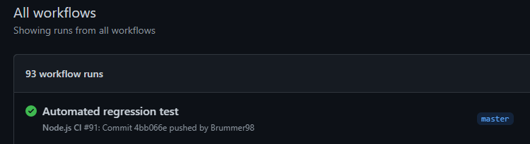

#### Docker

As part of CD i created an environment to set up several servers where my frontend, database and my backend could run on seperate servers. By doing so i increase my proficiency for ***learning outcome 4: CI/CD***. 

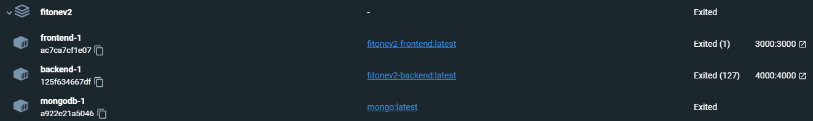

## Software Quality
Ofcourse to prove the necessary part for Software Quality, i needed to create a range of tests to show that all of my functionality in FitOne is working fine.
One tool to test all of my endpoints of the backend was ***Postman***. I used Postman to increment a series of queries, as shown in the image below: \

One of the first tests i did was a response test on how fast the response time was, or more exact: if the response time was less than ***200 ms***:

A second test i did was testing if the query was valid and that it would return a body:

A third test was for a succesful POST, like creating a user: \

### Sonarcloud

Sonarcloud is a tool to check your code on any faults or things that you could have done differently. It detects bugs and vulnerabilities and you can get instant feedback from sonarcloud. I implemented sonarcloud into my GitHub repository to let it do an analysis of my code and to see if something went wrong.

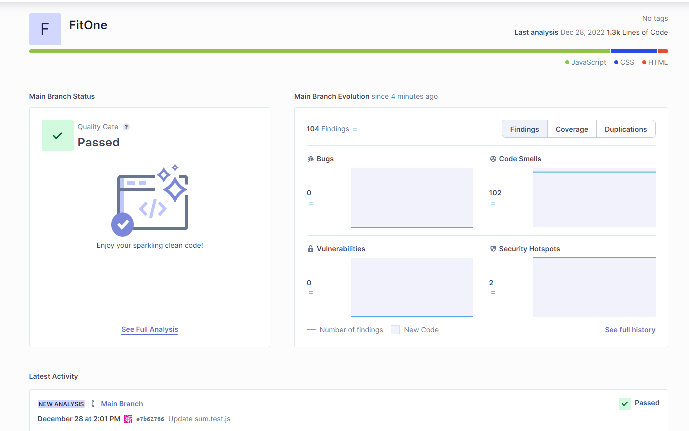

Sonarcloud will perform a analysis everytime a new push has been made to the main branch of the FitOne repository.

Since it had so many code smells and a couple of security risks, i started working on those to make sure that the next time sonarcloud would analyse my project, a ***passed*** would pop up in the screen again.

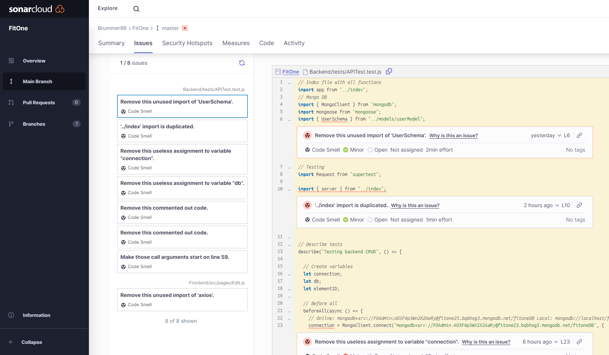

All of the above shown issues have been resolved, as you can see in the image below.

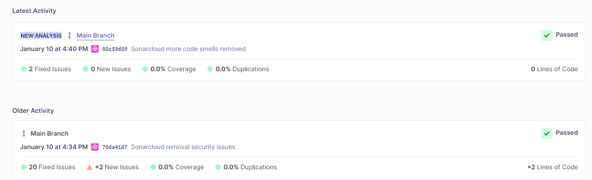

### Business process
To help improve my profiency for learning outcome ***7: Business process***, i've made a process that shows how a FitOne user adds an item to their diary. It shows how the client functions and also how the system handles what the client does.

#### Workshop business process and userstory mapping
Me and several other students created a workshop explaining what business process and userstory mapping are. To see these files and take a look into the presentation that we gave, you can click [here](https://github.com/fontys-open-up/2223nj-db03/tree/main/user-story-mapping-workshop)! By giving this workshop, i once more prove my proficiency for this learning outcome.

###### Business process
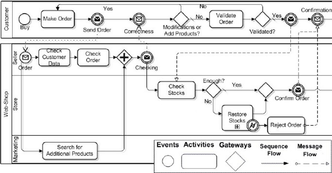

###### Business process management
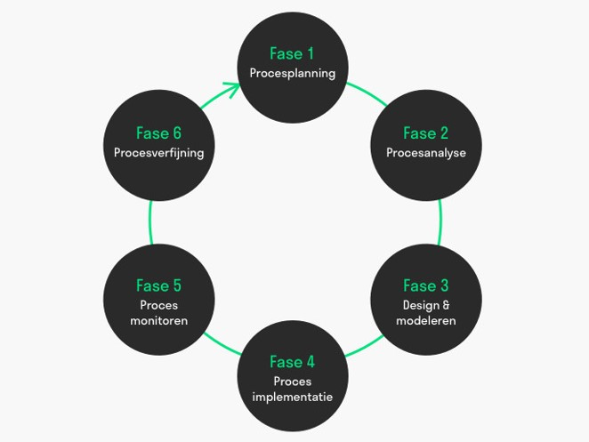

###### Userstory mapping steps
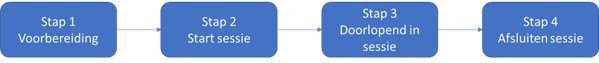

###### Userstory mapping
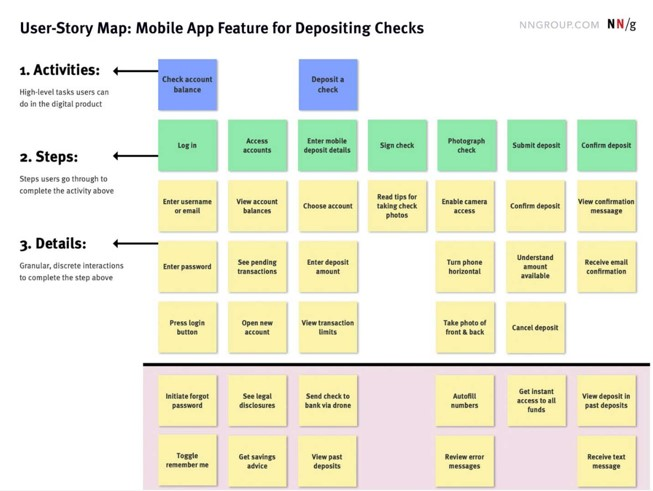

### Progress
##### Version 1.0
So far i've only been working on the frontend of the project. The backend is something i want to start with when November starts. I still need to do some additional research on what database i'm going to use for the project. We have been working with SQL during the first and second semester, but now in the third, we need to up our game! Most of the students i know are working with a database client called ***MongoDB***. MongoDB helps you ***not*** to use any SQL in your project. There might be a change that i'm going to use MongoDB for my individual project. As for now, i will be using ***.NET*** for my backend layer. The last two weeks i've been working hard on my portfolio in order to give a nice view of my current position in this semester and the things i've learned.

##### Version 1.1
My frontend has been completed and all of the remaining components that i wanted to design and implement are now complete. After the portfolio assigment and review, i got feedback about not having a backend at all. So, i started working on that right away. By implementing the ***MERN*** concept, i started creating a backend existing out of ***controllers, routes, a connection with mongodb and schemas***. By creating this type of backend, i also created a functional and complete ***CRUD*** system. That means that a user can now be created, edited and deleted. You can also check the details of a user and show a list of all users, simple CRUD! After that is started to de some research on [testing](Research/Testing.md) and [businessprocesses and userstory mapping](Research/BusinessProcesses.md). Currently i'm in the process of testing my backend functions. I already tested all of my endpoints as you can see [here](#ci-testing). Next up is to test all of the backend functions and testing some frontend data.

##### Version 1.2 ( final )
After completing my frontend and backend for the FitOne project, i started working on testing all of the backend functionalities using ***Jest*** and ***supertest***. This wasn't a very easy thing to acomplish. A lot of things went sideways and didn't go as planned. I created a workflow file where all of the test files in the backend folder would start. I had to go trough a lot of youtube video's and examples on the internet to finally understand not only the purpose of testing, but also how to properly test functionalities in your project. I tested the entire CRUD system and i works fine. Just to show how many times i tried to make the tests work, here is an image of my workflow files:

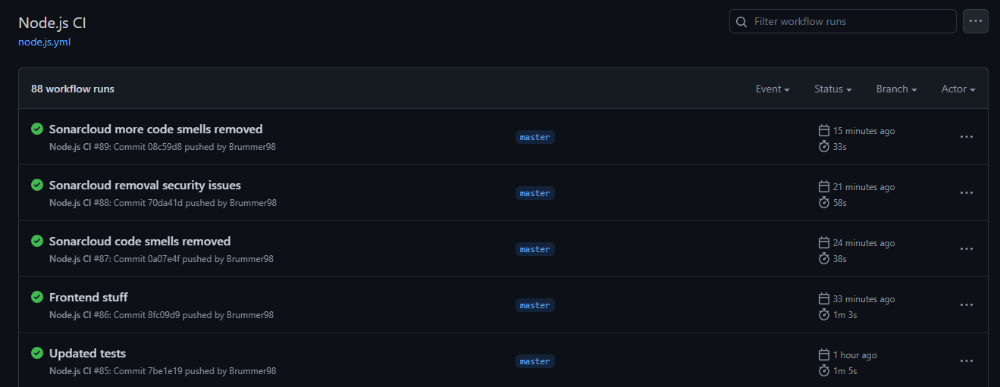

### What i've learned 
By creating the design document and going trough all of the elements within the document, i've learned several things:
* I've learned how to determine what requirements are important for the project to be written down, as well as splitting the requirements into functional- and non functional ones. I aslo managed to set priority to those requirements using MoSCoW.
* I've also learned how to develop wireframes to create a view of how the pages roughly are going to look like when the project is finished.
* I've learned how to create a architecture of the entire project, so you can see what kind of systems and other things are going to be connected to the system.
* Creating userstories was not really a new thing that i've learned, but i did improve it during semester 3!

## My perspective of the learning outcomes

### Web application
###### You design and build user-friendly, full-stack web applications

By doing the necessary research on design and what is best to use for the frontend of my project, by creating userstories, setting up requirements and implementing
a toolkit such as ***Bootstrap***. I've created a fullstack webapplication based on ***React JS*** and ***Node JS*** for the backend. I'd say that my score for this learning outcome is ***proficient***.

### Software quality
###### You use software tooling and methodology that continuously monitors and improve the software quality during software development

By making use out of tools like ***Postman***, for making sure that all of the endpoints in my system are working perfectly fine and are compiling the right data. By implementing security and authentication using ***Auth0*** and implemeting a tool called ***Sonarcloud*** to verify that my code is proper, i prove that my score for this learning outcome is ***proficient***. 

### Agile method
###### You can implement the software process for your project according to a given agile software development method

Because i make use out of an Agile method that i did a solid research on, which can be found [here](Research/AgileMethods.md), and also creating and keeping track of a consistent planning in the ***GitHub*** environment, i prove that my score for this learing outcome is ***proficient***. 

### CI/CD
###### You implement a (semi)automated software release process that matches the needs of the project context.

By doing the necessary research on what kind of tests should be done for my project and what kind of tests there are in general. Also by Automating a workflow file that performs my test script(s), testing endpoints in Postman, testing my backend, creating performance tests and testing the entire CRUD system. I prove my proficiency for this learning outcome to be ***proficient***.

### Cultural differences and ethics
###### You recognize and take into account cultural differences when working with multi-site teams, and are aware of ethical aspects in software development

By doing the necessary research on Ethics and how it works in the ***IT*** world, i'd say for now that i score ***Beginning*** for this learning outcome. To make sure this score wil go up to proficient, i'd say i have to do an analyze on either the individual- or the group project. 
The research file can be found [here](Research/Ethics.md).

###### Version 1.2 ( final )
By doing the necessary research on Ethics and how it works in the ***IT*** world and marking the research file into my own words and giving a perspective about the subject and telling about my own personal excperiences with ethics, i'd say that i score ***proficient*** for this learning outcome.

### Requirements and design
###### You translate (non-functional) requirements to extend existing (architectural) designs and can validate them using multiple types of test techniques

By first setting up a variety of functional and non-functional requirements, creating userstories and doing research for what kind of design i'd like to use in my project, i'd say that i score ***proficient*** for this learning outcome. 
The design research file can be found [here](Research/UXdesign.md).

### Business processes
###### You can explain simple business processes and relate them to the development of your software project.

By doing the necessary amount of research and creating a business process based on a functionality in my FitOne system, i rate the score of ***proficient*** for this learning outcome. You can see the research file [here](Research/BusinessProcesses.md), and the business process itself [here](#business-process).

### Professional
###### You act in a professional manner during software development and learning

By communicating with the stakeholder and asking for their needs, communicating with team members and behaving in a professional manner, and being able to show my progress during the sprints, for example see [sprint planning](https://github.com/users/Brummer98/projects/1/views/1), i'd give myself the score of ***proficient*** for this learning outcome. To see the contact between the stakeholder and i, click [here](Feedpulse/FP_Volledig.pdf).

## WoC ( Group Project )

### Agile 

As a team we chose to work the SCRUM agile method. So on a daily basis we had several meetings and created an environment where we summed up all of the issues withing
the project. Every meeting we took the time to look at the issues and speak up your mind about problems that we were having. That meant that we could all help eachother out and work out the issues one by one. 

#### Issues

We created issues to keep track of all the things that we need to do as a team, to finish the project. Everyone can create issues, not everyone can assign them to one another. Every issue comes with it's own description and checklist of things that must be done to finish the issue. 

#### Working as a team
We managed to make it work as a team by making use of the ***agile method: SCRUM***. Also by communicating to one another and having meetings offline- aswell as online. If anyone of us had a problem that we faced, there was always someone to help out and eliminate the issue. Before we started working on the project, we looked at everyones needs and what they wanted to do within the project. For example, Dirk and i are more interested in the frontend and dus ***React JS***, so we started working on that. While te other team members decided to be more involved in the backend of the project, which worked well. Eventually we mamaged to make great progress every sprint and show ***WoC*** that we were able to create a webapp based on their requirements.

###### What went right?
To be fair we actually managed to do pretty well as a team and split the issues among us all. The communication was great and everyone was excited to work on the project. Creating the issues and working with GitHub to have insights into eachoter's work was also a good thing. We Helped eachother out where we could and made great progress all along. 

###### What went wrong?
There were one or two sprint assignments where we had to show what we've been working on, but we did'nt prepare ourselfs well enough. Which lead to all being muted when we sat down and just staring at the one team member that brought the laptop to start talking. So, that was'nt so great. We did manage to create time to prepare ourselfs better for the next assignment. 

### Workflow
#### How does the system work?

You begin at the home page, where you are pesented a dropdown component where you select a retailer from.
In this case, we limited the list of options to ***two*** retailers:
* Albertheijn
* Jumbo

After selecting one of these options, the page will redirect to the main page loaded in with the corresponding data based on what retailer was chosen.
You can see an overal score in the progress bar on the top of the page, which represents the score of all products shown in the table. The table on the page is loaded with all the products that the retailer has in stock, where you are able to see what livescore every product has.

#### Widgets
We decided to go with several components on a dashboard- like design, which we call ***widgets***. These widgets each contain something different to show.
The page consist out of the following widgets:

###### Live & Not Live - Score
This widget contains a progressbar where the overal live and not live score has been stacked into. This widget provides an easy overview to all of the products their average livescores. 

###### Total amount of products
This widget contains the exact amount of products that the chosen retailer has in stock.

###### Products list
This widget contains a table which is filled with products that the retailer has in stock. The table consist out of the following columns:
* Ean
* Product description
* Status
* Similarity

### Backend 
For the logic for this project we created a ***RestAPI*** and two ***scrapers***. We also worked with ***MongoDB*** to create schemes and save necessary data into the database. 

#### Scrapers
Two of our team members were frocussed on building scrapers so we could get the necessary data from the retailer's websites. The scrappers simply look over to one of the retailer's page and checks what is on it. It then ***scrapes*** the data and puts it into a file. That data we can compare with the list of products data we got from ***WoC***. 

#### RestAPI
The restapi is a backend tool where we can fetch data to be shown on the frontend of the project. The special thing within this RestAPI is that we managed to create a ***wrapper*** to fetch data more easily, instead of working with ***axios*** posts and gets. 

## Architecture

### Frontend

#### Design
We decided to go for a ***dashboard*** like style. This because we then could add several widgets, which seem to work quit well with this project.
At first we started of with a neutral page, which showed several components. After getting some useful feedback from WoC, we decided to go for the dashboard style. 
The colors used on the page and in the components work wel with eachother, you can see what is non-functional and what is functional on the webpage.
There was a little bit of research needed to see what kind of styling would be best for this project. This depended on what kind of data we where going to show and what kind of components the data was loaded in. We also decided to make use of ***Bootstrap*** and build the page using ***React JS***. 

###### Bootstrap
Bootstrap has a very easy to use and user friendly system, called the ***Grid system***. This system was very useful to us because we wanted the dashboard type of 
layout, and this was very easy to implement. You could add ***Containers***, ***Rows*** and ***Columns*** to create a nice layout which was also responsive. 

###### React JS

### Livescore
The livescore is momenteraly calculated by comparing one ***snapshot*** to the existing list of ***products***. It checks for three different things:
* EAN code
* Title 
* Description ( bullet points )

If any of these don't compare to the ones in the products list, we re-calulate the score and show it on the front of the page.

The livescore is calculated in the frontend of the project, since it doesn't need to be saved in the backend database.

## Requirements and userstories

#### Requirements

###### Functional
* Importing the data (Must have)
* Read the data (Must have)
* Synchronise data with the retailers data (Must have)
* An User has to be able to create an account (Could have)
* An User has to be able to login (Could have)
* Switch pages to other languages (Could have)
* Store proucts in the database (Could have)

###### Non-Functional
* Displaying the synced data in graphs.
* The data synchronisation has to be done within 5 minutes.

#### Userstories
* As supplier I want to be able to select a retailer to be able to check an overview of the products (must)
* As an user I want to be able to get the result to know if my products are online with percentage of how many are online (must)
* As an user I want to to have an graph on the overview for a quick check to see how many of my products are online (must)
* As an user I have to be able to login to have access to my credentials (should)
* As an user I want to be able to create an account and get access to the application (should)
* As an user I want to be able to set the application to another language when I'm not capable enough to read/understand English (should)
* As an user I want to be able to compare multiple retailers, so I can see which retailer performs best in getting the products live (could)
* As an user I wnat to be able to import products to synchronise (could)

## Contributors

This project is realized by the following contributors.

